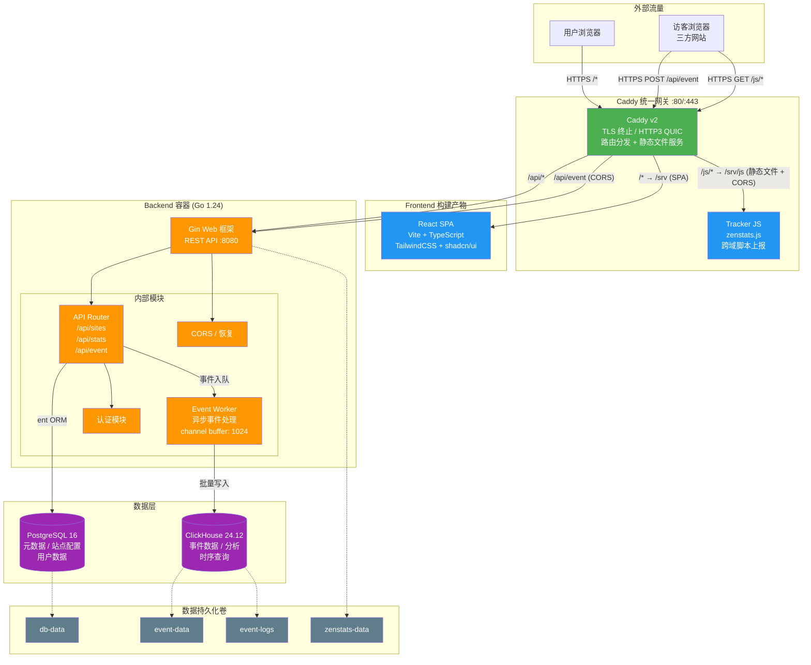
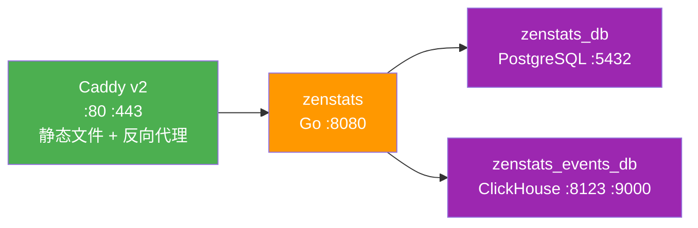

# ZenStats 部署架构图

## 整体架构 (Mermaid)



## Docker Compose 服务拓扑（4 服务，已移除 nginx）



## 目录结构

```
zenstats/
├── cmd/                    # CLI 入口 (cobra)
│   ├── root.go            # 根命令
│   ├── server.go          # server 子命令
│   ├── migrate.go         # 数据库迁移
│   └── seed.go            # 种子数据
├── config/                 # 配置文件 (YAML)
├── internal/               # 内部包
│   ├── api/               # API 路由 & 处理器
│   │   ├── router/        # 路由注册
│   │   └── stats/         # 统计相关 API
│   ├── auth/              # 认证
│   ├── bootstrap/         # 启动初始化
│   ├── event/             # 事件处理 (ClickHouse)
│   ├── middleware/         # 中间件
│   ├── service/           # 业务逻辑层
│   │   └── stats/         # 统计服务
│   ├── session/           # 会话管理
│   └── store/             # 数据访问层 (ent)
│       └── postgresql/    # ent schema 生成
├── pkg/                    # 公共包
├── deploy/                 # 部署配置
│   ├── docker-compose.yml       # 生产环境
│   ├── docker-compose.dev.yml   # 开发环境覆盖
│   ├── Caddyfile                # Caddy 路由 + 静态文件配置
│   ├── .env / .env.example      # 环境变量
│   └── clickhouse/              # ClickHouse 配置
├── web/                    # 前端子模块 (React SPA)
│   ├── src/               # 源码 (TypeScript)
│   ├── public/            # 静态资源 (含 tracker JS)
│   └── dist/              # 构建产物
├── tracker/               # Tracker JS 源码 (npm)
├── sql/                   # SQL 迁移脚本
├── Dockerfile             # 后端 Go 镜像
├── Dockerfile.caddy       # Caddy 网关镜像 (3 阶段构建：Tracker → React → Caddy)
├── Makefile               # 构建/部署命令
└── main.go                # 程序入口
```

## 关键数据流

```
访客浏览器 (三方网站)
    │
    ├── GET  /js/zenstats.js ──→ Caddy ──→ /srv/js 静态文件 (file_server + CORS)
    │                                         │
    │                                    返回 tracker 脚本
    │
    └── POST /api/event ──────→ Caddy ──→ Gin ──→ Event Worker Queue
                                                      │
                                                 批量写入 ClickHouse
                                                      │
管理后台                                         统计分析查询
    │                                                 ↑
    ├── /api/sites (CRUD) ──→ Gin ──→ PostgreSQL      │
    │                                                 │
    └── /api/stats/* ────────→ Gin ──→ ClickHouse ────┘
```

## 开发环境 vs 生产环境

| 特性 | 开发环境 | 生产环境 |
|------|---------|---------|
| 命令 | `make dev-up` | `make prod-up` |
| 数据库端口暴露 | ✅ (5432, 8123, 9000) | ❌ (仅内部) |
| Caddy TLS | 自签名证书 | Let's Encrypt |
| 后端端口 | 8080 暴露 | 8080 暴露 (通过 Caddy) |
| 热重载 | 本地 `go run` | 无 |

## 镜像构建

### 后端 (Dockerfile)
- 多阶段构建: `golang:1.24-alpine` → `alpine:3.20`
- 非 root 用户运行
- 二进制: `/app/zenstats server`
- 端口: 8080

### Caddy 网关 (Dockerfile.caddy)
- 三阶段构建:
  1. `node:20-alpine` - 编译 Tracker JS
  2. `node:22-alpine` - 构建 React SPA (pnpm)
  3. `caddy:2-alpine` - 运行时：静态文件服务 + 反向代理
- 前端产物部署到 `/srv`，Caddy 通过 `file_server` 直接 serve
- 无需额外 Web Server（已移除 nginx）
- 端口: 80 / 443 / 443/udp (HTTP/3 QUIC)

## 架构变更说明

### 已移除 nginx
原架构中 frontend 容器运行 nginx 提供静态文件服务，现由 Caddy 直接 `file_server` 替代：

| 原 nginx 职责 | 新方案（Caddy） |
|---|---|
| SPA 路由 `try_files $uri /index.html` | `try_files {path} /index.html` |
| Gzip 压缩 | `encode gzip` |
| 静态资源缓存 | `header Cache-Control` |
| Tracker JS CORS | `header Access-Control-Allow-Origin "*"` |

### 服务数量
- **之前**：5 服务 (caddy + frontend + backend + postgres + clickhouse)
- **之后**：4 服务 (caddy + backend + postgres + clickhouse)